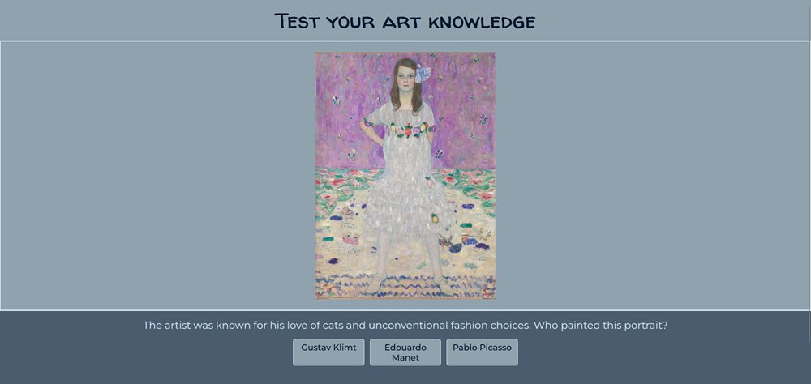
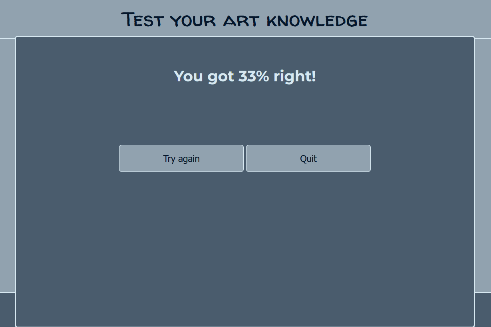

# Test Your Art Knowledge
Test Your Art Knowledge website is designed to popularize art and promote art history knowledge in an entertaining way. 

## Demo

Link to the live site here: <https://codebymai.github.io/art-quiz/>

---

# Table of contents

* [User Experience (UX)](#user-experience-ux)

* [Languages Used](#languages-used)

* [Design](#design)

* [Features](#features)

* [Testing](#testing)

* [Deployment](#deployment)

* [Solved Bugs](#solved-bugs)

* [Credits](#credits)
  
* [Acknowledgements](#acknowledgements)
  
---

# User Experience (UX)

Test Your Art Knowledge website allows users to test their knowledge of visual art.  Through the use of thoughtful comments it offers snipets of knowledge and suggestions on how to expand it.

* Client Goals
   * Promoting knowledge of visual art in an entertaining and accessible manner.
   * Showcase the art and artist.
   * Dispel the myth that learning art history has to be tedious through gamifying it.
   * Encourage visitors to learn more about the featured artists, paintings and art movements.(e.g. including information about the artistic movement/style that the artwork represents: "This portrait was painted by Hans Holbein the Younger. It is a great example of Northern Renaissance style.")
   * Convincing users that art history is not only interesting but can also be entertaining. (e.g. inclusion of fun fact about the artist in the question: "The artist was known for his love of cats and unconventional fashion choices.")
    
* Visitor Goals
   * Testing their existing art knowledge.
   * Learning more about art and artists.
   * Learning to experience art.
   * Enjoying interacting with art and art history.
   * Discovering fun facts about artists.

---

### Languages Used

* HTML
* CSS
* JavaScript

---

## Design

* Wireframes

* Colour Scheme
I have chosen neutral blue gray colour scheme to allow the paintings to stand out.

* Typography

The fonts Montserrat and Walter Turncoat were imported from [Google Fonts](https://fonts.google.com/).

* Imagery

All images used are copyright free and come from Google Arts & Culture platform (https://artsandculture.google.com/)

* Icons

[Font awesome](https://fontawesome.com/icons)

---

## Features

### Existing Features

The website consists of two sections.
Both sections feature a header and a footer.

#### Start Page

Start page contains:
* Simple quiz instructions. 
* Start Quiz button which opens the Quiz Page.
* Collection of paintings as a background to create the mood for art appreciation.

#### Footer
Footer contains:
* Social media links. The links take the users to the home page of the social media platforms as the website doesn't have social media profiles yet.

#### Quiz Section

Quiz section consists of:
* Image of the artwork.
* Question about the name of the artist.
* Three buttons with possible choices of the names.

When one of the buttons is clicked it results in an alert window popping up on the screen:
* It states if the answer is correct.
* It also offers the user some further information anout the artist, the painting or the style.
* Once OK button is pressed, next question is loaded.

When user answers 3 questions an alert window informs them what percentage of their answers was correct.

### Potential Future Updates and Features

* Due to the time constraints Quiz only features three questions. Ideally I would like to expand it to at least 50 questions and increase amount of questions in the round to 5. 
* Presenting results in HTML rather than alert form.
* Introducing comments to the results depending on the score.
* Including a feature allowing users to share their results on social media.
* Downsizing images to improve performance.
* Customized 404 page.

---

## Testing

The website's responsiveness was manually tested on the following devices:
* laptop 14";
* iPad Pro 12.9";
* Samsung Galaxy S21;
It has been found to be responsive on all of the above.

### W3C Validator

### W3C CSS Validator

### JSHint Validator

### Accessibility

  * Semantic HTML.
  * Colour contrast.
  * Sans serif font.

The accessibility was confirmed by running it through lighthouse in devtools.

Overal score was affected by the weight of images included. 

## Deployment 

### Deployment

The page was created using VS Code and deployed to Github.

1. Log in (or sign up) to Github.
2. Navigate to the repository.
3. In Settings, under Code and Automation, select Pages.
4. From a branch under Source select Deploy.
5. Select the main branch.

### Forking

1. Log in to GitHub and locate the [GitHub Repository](https://github.com/codebyMai/art-quiz)
2. In the top-right corner of the page, click Fork.
3. Once clicked, you should have a copy of the repository.

### Cloning

1. On GitHub.com, navigate to your fork of the repository.
2. Above the list of files, click Code.
3. Select if you prefer to clone using HTTPS, SSH, or GitHub CLI and click the copy button to copy the URL to your clipboard.
4. Open Git Bash.
5. Change the current working directory to the location where you want the cloned directory.
6. Type git clone, and then paste the URL you copied earlier.
7. Press Enter to create your clone.

## Solved Bugs

1. Prevent margin from an inner div "instruct" from collapsing margin of the outer div "backround".
   * Added overflow : auto to the outer div.
2. Background image on the start section was too short for longer screens of mobile devices, leaving a gap at the bottom.
   * Fixed by adding vertical repetition.
3. Answer buttons were too wide on mobile screens.
   * Adding media query adjusting width of the answers.
   
---

## Credits

## Media

* [Font awesome](https://fontawesome.com/icons)
* [Coolors](https://coolors.co/)
* [Google Fonts](https://fonts.google.com/)
* [Mockup Screenshot Generator](https://ui.dev/amiresponsive)
* [Google Arts & Culture platform](https://artsandculture.google.com/)

## Reference Material

* [Love Math Walkthrough project](https://learn.codeinstitute.net/ci_program/diplomainsoftwaredevelopmentecomm)
* [W3 School](https://www.w3schools.com)
* [Stackoverflow](https://stackoverflow.com/)
* [Demystifying The CSS Display Property](https://coderpad.io/blog/development/demystifying-the-css-display-property/)

Following tutorials helped me to understand the mechanics of bulding a quiz in JavaScript:

* [How to Make a Simple JavaScript Quiz](https://www.sitepoint.com/simple-javascript-quiz/)
* [How To Make Quiz App Using JavaScript](https://www.youtube.com/watch?v=PBcqGxrr9g8)
* [Let’s Build a Multiple Choice Quiz App With JavaScript](https://webdesign.tutsplus.com/multiple-choice-quiz-app-with-javascript--cms-107756t)
* [Create a Multiple Choice Quiz App Using JavaScript](https://www.youtube.com/watch?v=49pYIMygIcU)
* [Build A Quiz App With JavaScript](https://www.youtube.com/watch?v=LJ4PZ8JnRCg)

---

## Acknowledgements

* Mentor and Tutor suport at Code Institute.

